<h1>Дипломный проект "Блоговый движок"</h1>

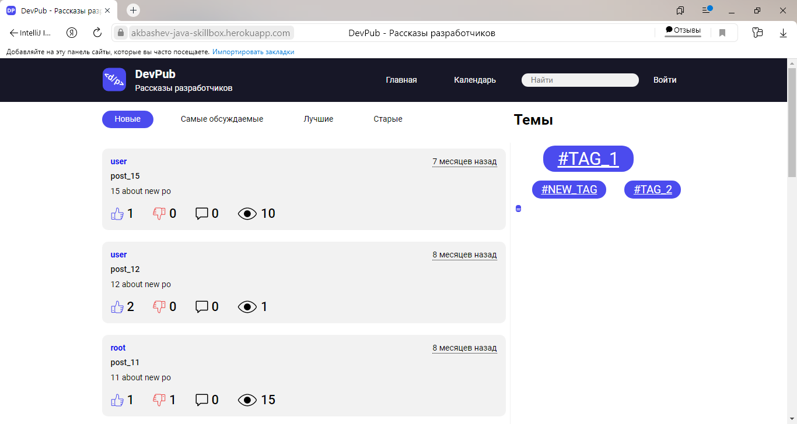
https://akbashev-java-skillbox.herokuapp.com
Дипломный проект "Блоговый движок" (далее - движок) - 
был разработан как способ проверки усвоенных знаний, 
после прохождения полного курса на Skillbox 
"Java-разработчик с 0 до Про" 
https://go.skillbox.ru/profession/profession-java.
Движок является бэкэндом, для взаимодействия
фронта с базой данных (далее - БД).
На основном окне располагаются по умолчанию все **Новые** 
публикации. Также можно просмотреть 
**Самые обсуждаемые**
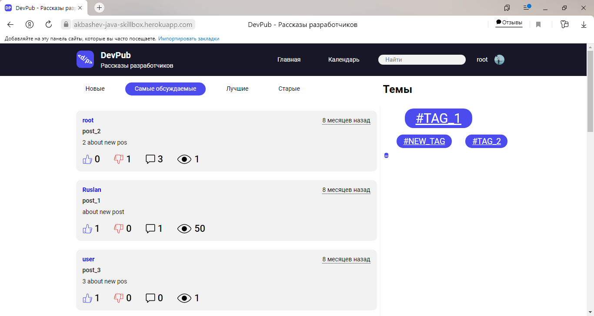
**Лучшие** 
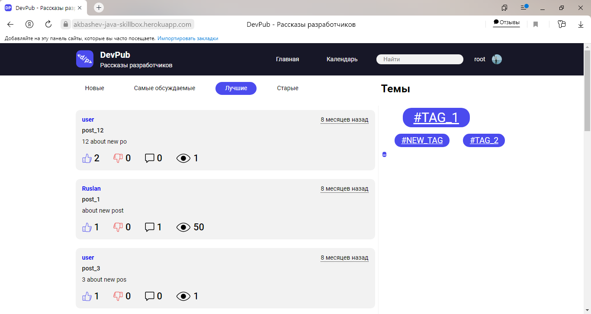
и **Старые** публикации.
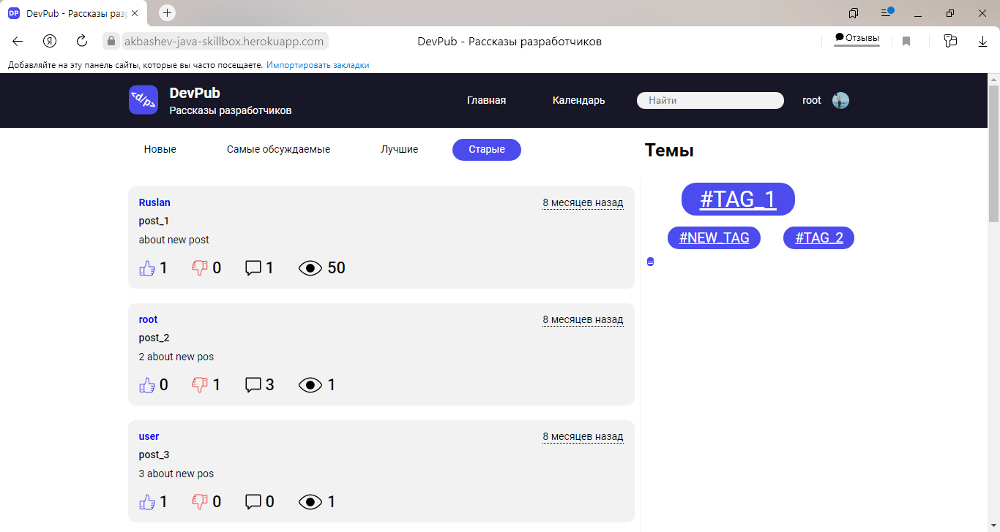
Постоянно отображаются не более 10 публикаций, если же 
их больше внизу страницы отображается кнопка с количеством 
оставшихся публикаций.
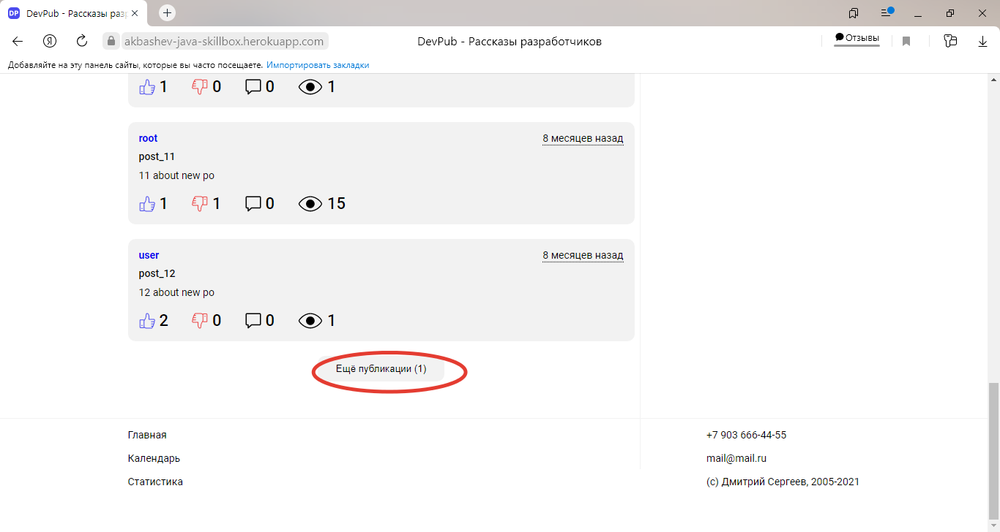
**Календарь** отображает информацию о том когда и 
сколько было опубликовано публикаций.
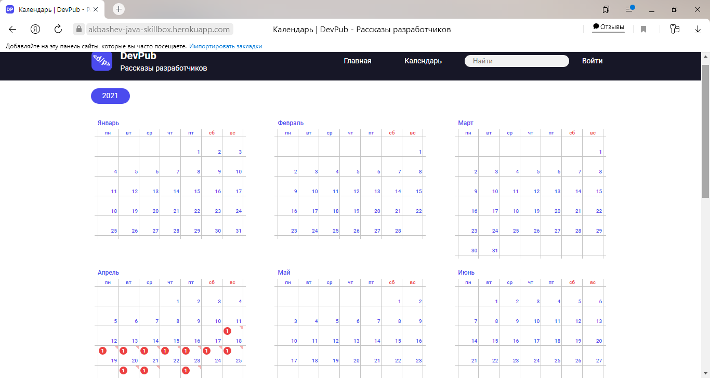
На главной странице присутствует раздел **Темы**
в котором находяться **тэги**,
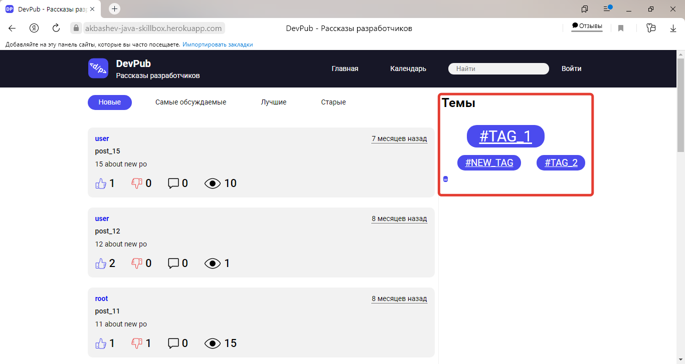
по **тэгам** также можно проводить выборку, стоит 
только выбрать необходимый **тэг**
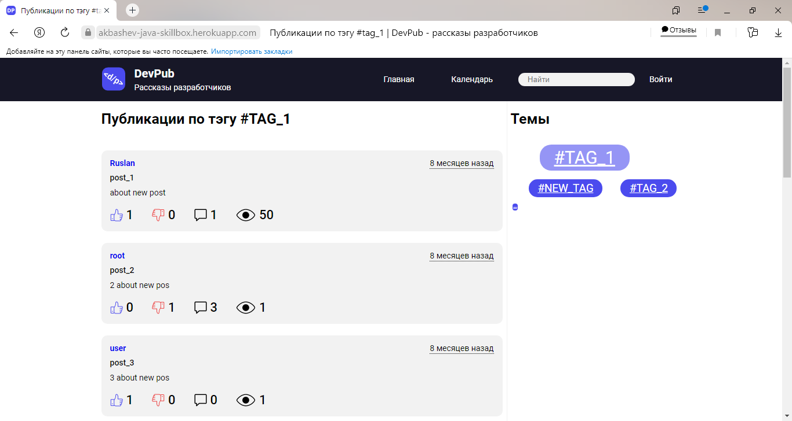
Указанный выше функционал реализован для неавторизованных
пользователей.
Авторизоваться пользователь может как с правами модератора,
так и с правами обычного пользователя. Основным отличием
будет наличие у модератора возможности одобрять/отклонять
публикации пользователей.
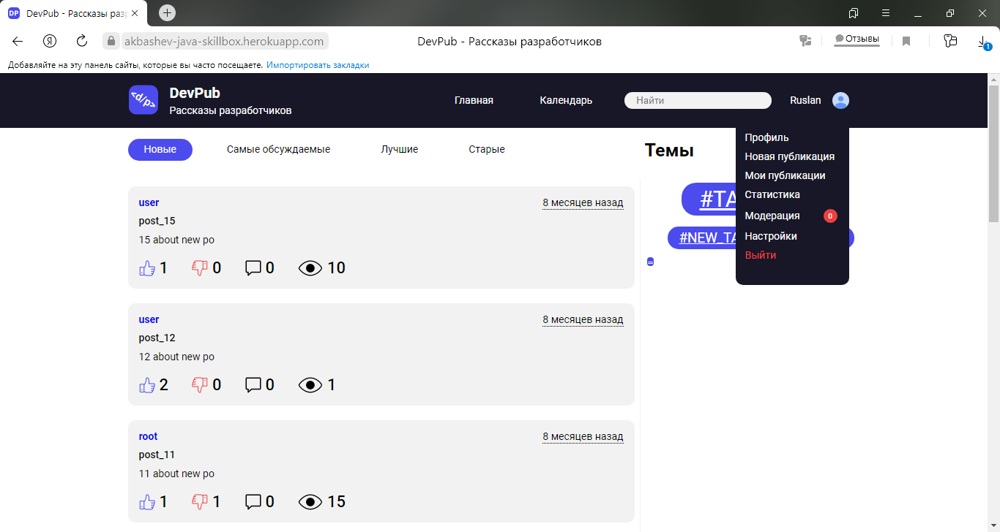
У всех пользователей есть разделы "**Профиль**".
В данном разделе пользователь может установить **аватарку**,
либо изменить такие данные как *Email*, *Имя* или *Пароль*.
Если все будет указано верно, то при нажатии кнопки ***Сохранить***
изменения вступят в силу.
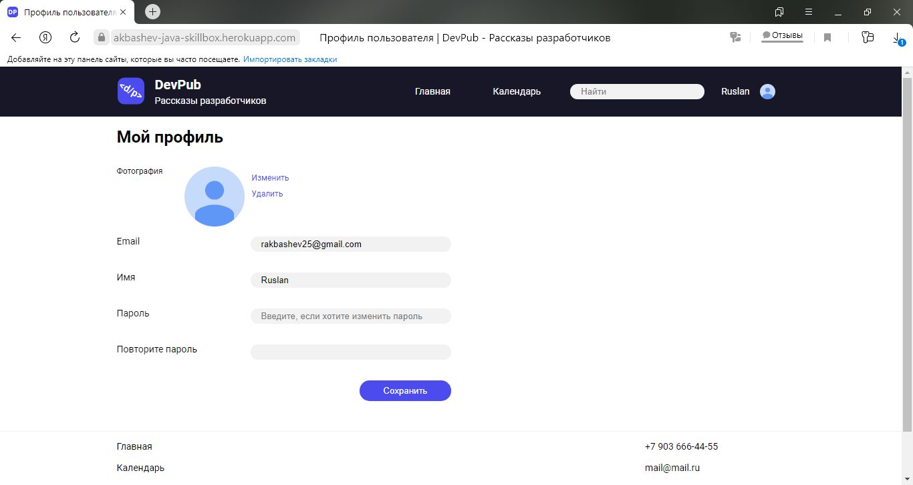
Раздел "**Новая публикация**". В данном разделе можно 
создать публикацию, которая получит статус **NEW** и будет
ждать своего одобрения/отклонения модератором.
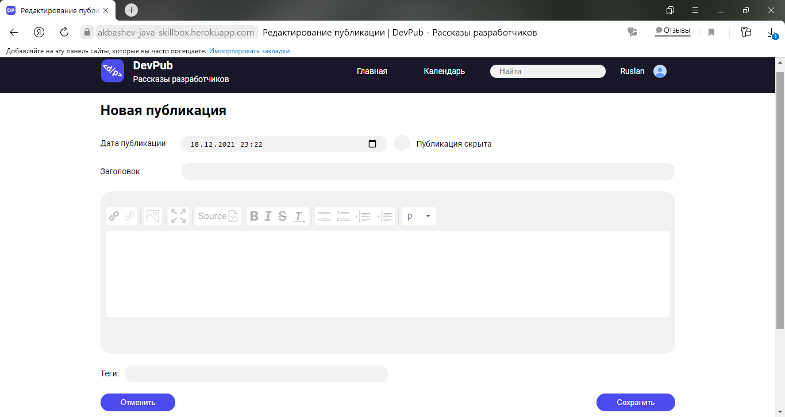
Раздел "**Мои публикации**", отражает все публикации 
созданные авторизованным пользователям, независемо от
того получили они одобрение или нет. Статусы публикаций 
могут быть: *скрытые*, *активные*, *отклоненные* или 
*опубликованные*.
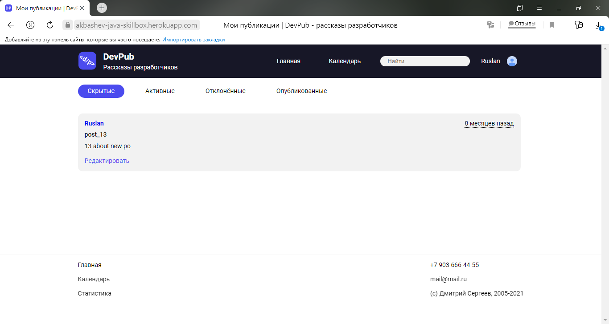

